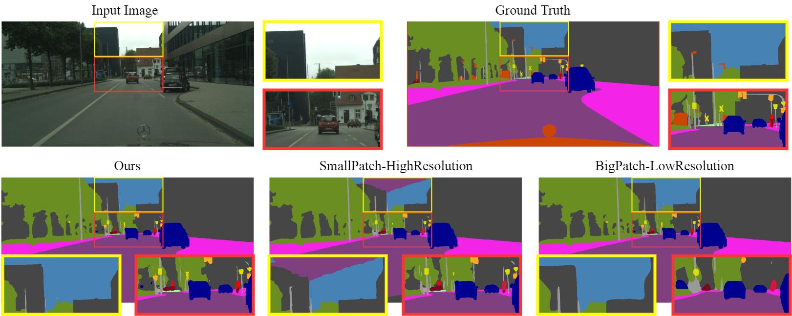
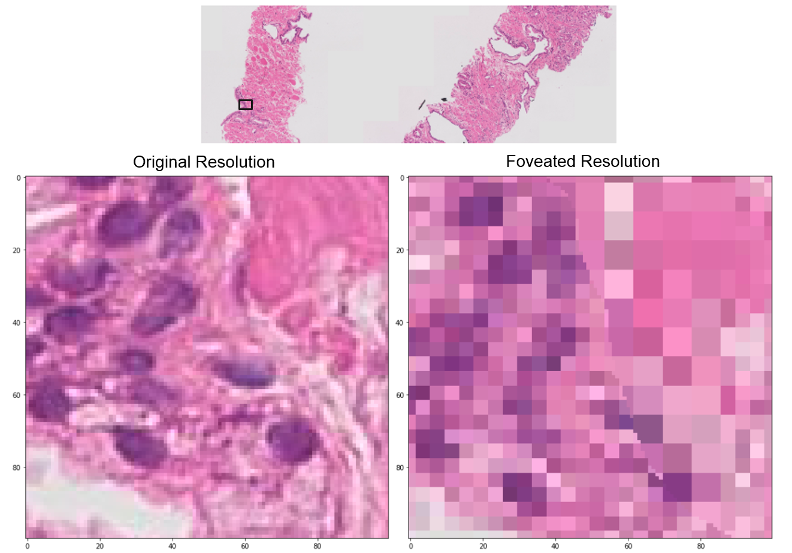

# Foveation for Segmentation of Ultra-High Resolution Images in PyTorch

[](LICENSE.md)


This is a PyTorch implementation of [Foveation for Segmentation of Ultra-High Resolution Images](https://arxiv.org/abs/2007.15124v2) which extends [our prior publication at MICCAI 2020](https://discovery.ucl.ac.uk/id/eprint/10113531/1/paper1822.pdf).

### Table of Contents
1. [Updates](#updates)
1. [Introduction](#introduction)
1. [Foveation Module](#foveation-module)
1. [Citation](#citation)
1. [Install dependencies](#install-dependencies)
1. [Code Summary](#code-summary)
1. [Direct-Executable](#direct-executable)
1. [Deploy-Your-Model](#deploy-your-model)
1. [Deploy-Foveation-Module-Locally](#deploy-foveation-module-locally)
1. [Performance](#performance)
1. [Acknowledgements](#acknowledgements)

## Updates
- MICCAI 2020 talk on youtube available [HERE](https://youtu.be/MxaO9DtNeEQ)
- Pre-processed Gleason2019 datasets is shared [HERE](https://liveuclac-my.sharepoint.com/:f:/g/personal/ucaccji_ucl_ac_uk/EjEx-QVxTrpKsha3JoyAAa8ByZe2zU69K_youFo53OQnzg?e=OiRXCU)
- We use configuration files to store most options which were in argument parser. The definitions of options are detailed in ```config/defaults.py``` (TO-BE-UPDATED).

## Introduction
We demonstrates that the trade-off between FoV and resolution affects the segmentation performance on ultra high resolution images. Its influence also varies spatially according to local patterns in different areas. We demonstrate, on three publicly available high-resolution image datasets that our proposed **Foveation Module** combines the strength of the cases trained with patches of different fixed FoV/resolution trade-off and improves segmentation performance, below is a validation segmentation example on **CityScapes** compared ours against two fixed trade-off configurations:
 

## Foveation Module
**Foveation Module** is a learnable ```dataloader``` which, for a given ultra high resolution image, adaptively chooses the appropriate configuration (FoV/resolution trade-off) of the input patch to feed to the downstream segmentation model at each spatial location of the image, illustrated as below:


We demonstrate that our **Foveation Module** can effectively learn spatial distribution ofthe FoV/Resolution trade-off, illustrated as below:


Conceptually, the **Foveation Module** has an effect of adjusting patch-wise resolution at each location at optimal states for downstream task (segmentation in this case), illustrated as below:




## Citation
If you use this code for your research, please cite our paper:

```
@misc{jin2020foveation,
    title={Foveation for Segmentation of Ultra-High Resolution Images},
    author={Chen Jin and Ryutaro Tanno and Moucheng Xu and Thomy Mertzanidou and Daniel C. Alexander},
    year={2020},
    eprint={2007.15124},
    archivePrefix={arXiv},
    primaryClass={cs.CV}
}

@inproceedings{jin2020foveation,
  title={Foveation for Segmentation of Mega-Pixel Histology Images},
  author={Jin, Chen and Tanno, Ryutaro and Xu, Moucheng and Mertzanidou, Thomy and Alexander, Daniel C},
  booktitle={International Conference on Medical Image Computing and Computer-Assisted Intervention},
  pages={561--571},
  year={2020},
  organization={Springer}
}
```

## Install dependencies
Install dependencies with one of the following options:
* Method 1: Pip installation:
```
python -m pip install -r requirements.txt
```
* Method 2: Conda installation:
```
conda env create -f environment.yml
conda activate Fov_Seg
```
This code was tested with python 3.7, pytorch 1.2 and CUDA 11.0

## Code Summary
We provide below three ways for users to easily run/deploy **Foveation Segmentation**: [Direct-Executable](#direct-executable), [Deploy-Your-Model](#deploy-your-model) and [Deploy-Foveation-Module-Locally](#deploy-foveation-module-locally).
- [Direct-Executable](#direct-executable): full code direct executable to reproduce paper results, also suitable to run large scale experiments on customerized data in multiple GPU Environment, Syncronized Batch Normalization are deployed.
- [Deploy-Your-Model](#deploy-your-model): Our **Foveation Module** can attach to any segmentation models. Our framework includes a set of State-of-the-Art segmentation models ([PSPNet](https://arxiv.org/abs/1612.01105)/[UPerNet](https://arxiv.org/abs/1807.10221)/[Unet](https://arxiv.org/abs/1505.04597)/[HRNet](https://arxiv.org/abs/1904.04514)) for user to choose. It's also straightforward to deploy personlized segmentation model in this framework, instruction are given.
- [Deploy-Foveation-Module-Locally](#deploy-foveation-module-locally): a Simple-Demo segmentation example to illustrated how to implement **Foveation Module** to your own code.


## Direct-Executable

### Data preparation
1. Download example ultra-high resolution datasets in following table as used in the paper, or prepare of your choice ultra-high resolution images (e.g. medical/aerial/camera-array/material images) for multiclass segmentation purpose.

    | Dataset (with Link) | Content | Resolution (pixels) | Number of Classes |
    | :--: | :--: | :--: | :--: |
    | [Cityscapes](https://www.cityscapes-dataset.com/) | urban scenes |  2048x1024 | 19  |
    | [DeepGlobe](https://competitions.codalab.org/competitions/18468) | aerial scenes |  2448x2448 | 6 |
    | [Gleason2019](https://gleason2019.grand-challenge.org/) | histopathological |  5000x5000 | 4 |

2. Your directory tree should be look like this:
````bash
$SEG_ROOT/data
├── cityscapes
│   ├── annotations
│   │   ├── testing
│   │   ├── training
│   │   └── validation
│   └── images
│       ├── testing
│       ├── training
│       └── validation
````

3. Prepare data list file according to .odgt files in ```./data/Cityscape/```, a script ```./data/write_MIT_format.m``` has been given to prepare .odgt file, PATH and suffix need to be customerized.


### Training
Train a model by selecting the GPUs (```$GPUS```) and configuration file (```$CFG```) to use. During training, checkpoints by default are saved in folder ```ckpt```.
```bash
python3 train_fove.py --gpus $GPUS --cfg $CFG
```
- To choose which gpus to use, you can either do ```--gpus 0-7```, or ```--gpus 0,2,4,6```.

* You can start with our provided configurations (cityscape example):
```bash
python3 train_fove.py --gpus GPUS --cfg config/foveation-cityscape-hrnetv2.yaml
```

* Alternatively, you can quick start with provided bash script
```bash
bash quick_start_bash/cityscape_gumbel_softmax_1_10th.sh
```

* You can also override options in commandline, for example  ```python3 train_fove.py TRAIN.num_epoch 10 ```.


### Evaluation
1. Evaluate a trained model on the validation set. run ```eval_multipro.py``` with ```VAL.*``` arguments configured.

* You can start with our provided configurations:
```bash
python3 eval_multipro.py --gpus GPUS --cfg config/foveation-cityscape-hrnetv2.yaml
```

* Alternatively, you can quick start with provided bash script
```bash
bash quick_start_bash/deepglob_argmax_st_1_10th_eval.sh
```

## Deploy-Your-Model
1. The segmentation models in our framework are split into encoder and decoder, where encoders are usually modified directly from classification networks, and decoders consist of final convolutions and upsampling. Following architectures are supported:

      | Encoder | Decoder |
      | :--: | :--: |
      | MobileNetV2dilated | C1 (one convolution module) |
      | ResNet18/ResNet18dilated | C1_deepsup (C1 + deep supervision trick) |
      | ResNet50/ResNet50dilated | Pyramid Pooling Module |
      | ResNet101/ResNet101dilated | PPM_deepsup (PPM + deep supervision trick) |
      | Unet | UPerNet (Pyramid Pooling + FPN head) |
      | HRNetV2 (W48) | - |

2. To deploy your personlized model, first prepare your model follow ```models/attention_u_net.py``` and put it under ```models/```;

3. Then simply add your model in ```def build_encoder``` and ```def build_decoder``` functions in ```models/models.py```.


## Deploy-Foveation-Module-Locally
A Simple-Demo segmentation example is given as follows:
1. dataset for simple-demo are prepared at ```data/CITYSCAPE_single_example```
2. quick test simple demo with:
```bash
python3 train_sim_demo.py
```
3. implement foveation module to your own code following ```train_sim_demo.py```, includes:
* import our libs:
```bash
from config import cfg
from dataset import TrainDataset, b_imresize
from models import ModelBuilder, SegmentationModule, FovSegmentationModule
from train_fove import checkpoint_last, train, create_optimizers
from eval import eval_during_train
```
* add **foveation module** in network builder, train and evaluation (i.e. lines following ```if cfg.MODEL.foveation:``` in ```train_sim_demo.py```)

## Performance

1. Segmentation performance measured in IoU/mIoU (%) on [Cityscapes](https://www.cityscapes-dataset.com/). For class names: All referred to all classes average, and the rest single class codes are as follows: DeepGlobe: Ro.-road, Sw.-sidewalk, Bu.-building, W.-wall, F.-fence, P.-pole, T.L.-traffic light, R.S.-raffic sign, V.-vegetation, Te.-terrain, Sk.-sky, P.-person, RI.-rider, C.-car, Tru.-truck, Tra.-train, M.-motorcycle, Bi.-bicycle.

| Class | All | Ro. | Sw. | Bu. | W. | F. | P. | T.L. | R.S. | V. | Link |
| :--: | :--: | :--: | :--: | :--: | :--: | :--: | :--: | :--: | :--: | :--: |  :--: |
Baseline-Patch 1 | 67.7 | 97.6 | 80.8 | 89.8 | 49.7 | 51.4 | 53.9 | 39.0 | 63.3 | 89.6 | [OneDrive]()/[BaiduYun(Access Code:123)]() |
Baseline-Patch 2 | 68.0 | 97.3 | 81.0 | 89.5 | 41.9 | 52.2 | 51.5 | 32.9 | 66.0 | 89.2 | [OneDrive]()/[BaiduYun(Access Code:123)]() |
Baseline-Patch 3 | 69.8 | 97.5 | 81.2 | 90.3 | 47.0 | 55.8 | 54.2 | 46.8 | 68.6 | 90.0 | [OneDrive]()/[BaiduYun(Access Code:123)]() |
Baseline-Patch 4 | 70.6 | 97.0 | 82.1 | 89.8 | 47.3 | 53.4 | 57.6 | 56.9 | 72.1 | 90.3 | [OneDrive]()/[BaiduYun(Access Code:123)]() |
Baseline-Patch 5 | 70.2 | 95.0 | 84.4 | 90.3 | 45.6 | 56.2 | 63.4 | 61.4 | 76.5 | 91.4 | [OneDrive]()/[BaiduYun(Access Code:123)]() |
Baseline-Random | 50.3 | 94.1 | 68.1 | 80.7 | 36.5 | 40.2 | 18.8 | 13.3 | 31.8 | 79.6 | [OneDrive]()/[BaiduYun(Access Code:123)]() |
Baseline-Average | 56.6 | 96.3 | 73.6 | 85.7 | 31.6 | 40.4 | 39.0 | 19.8 | 49.8 | 86.5 | [OneDrive]()/[BaiduYun(Access Code:123)]() |
Ensemble | 72.5 | 97.7 | 83.8 | 91.1 | 51.7 | 58.2 | 58.9 | 50.9 | 72.6 | 90.9 | [OneDrive]()/[BaiduYun(Access Code:123)]() |
Ours-Mean |  **76.1** |  **98.2** |  **84.9** |  **92.3** |  **55.2** |  **61.4** |  **64.5** |  **71.4** |  **80.1** |  **92.5** | [OneDrive]()/[BaiduYun(Access Code:123)]() |
Ours-Mode | 71.4 | 97.5 | 80.8 | 90.8 | 45.4 | 55.3 | 55.6 | 56.5 | 67.7 | 90.7 | [OneDrive]()/[BaiduYun(Access Code:123)]() |
Ours-GSM | 70.5 | 97.7 | 82.2 | 89.1 | 44.8 | 55.4 | 64.5 | 66.1 | 76.2 | 91.8 | [OneDrive]()/[BaiduYun(Access Code:123)]() |


| Class | Te. | Sk. | P. | Ri. | C. | Tru. | Bus | Tra. | M. | Bi. | Link |
| :--: | :--: | :--: | :--: | :--: | :--: | :--: | :--: | :--: | :--: | :--: |  :--: |
Baseline-Patch 1 | 59.4 | 90.4 | 73.9 | 51.6 | 91.9 | 54.9 | 74.0 | 61.3 | 45.3 | 69.1 | [OneDrive]()/[BaiduYun(Access Code:123)]() |
Baseline-Patch 2 | 55.9 | 90.1 | 75.3 | 55.4 | 92.0 | 54.1 | 80.2 |  **74.8** | 43.7 | 69.8 | [OneDrive]()/[BaiduYun(Access Code:123)]() |
Baseline-Patch 3 | 57.4 | 88.8 | 77.1 | 56.9 | 92.8 | 57.4 | 76.8 | 63.6 | 51.5 | 72.5 | [OneDrive]()/[BaiduYun(Access Code:123)]() |
Baseline-Patch 4 | 56.7 | 85.6 | 79.0 | 60.0 | 92.8 | 54.0 | 78.2 | 58.1 | 56.8 | 74.2 | [OneDrive]()/[BaiduYun(Access Code:123)]() |
Baseline-Patch 5 | 59.9 | 68.9 | 81.2 | 58.0 | 93.2 | 53.0 | 69.6 | 50.6 |  **59.3** | 76.8 | [OneDrive]()/[BaiduYun(Access Code:123)]() |
Baseline-Random | 50.7 | 58.4 | 53.8 | 34.4 | 79.1 | 49.3 | 46.3 | 37.8 | 31.2 | 51.6 | [OneDrive]()/[BaiduYun(Access Code:123)]() |
Baseline-Average | 47.5 | 89.3 | 65.7 | 43.6 | 89.0 | 47.6 | 45.7 | 38.6 | 23.2 | 61.6 | [OneDrive]()/[BaiduYun(Access Code:123)]() |
Ensemble | 60.9 | 90.9 | 79.4 | 60.1 | 93.2 | 57.1 | 79.6 | 69.0 | 56.4 | 74.8 | [OneDrive]()/[BaiduYun(Access Code:123)]() |
Ours-Mean |  **64.2** |  **94.1** |  **82.8** |  **64.0** |  **94.5** | 63.6 |  **81.0** | 63.3 | 59.2 |  **78.2** | [OneDrive]()/[BaiduYun(Access Code:123)]() |
Ours-Mode | 60.8 | 92.1 | 75.5 | 55.8 | 93.1 |  **66.0** | 76.4 | 69.9 | 54.5 | 71.6 | [OneDrive]()/[BaiduYun(Access Code:123)]() |
Ours-GSM | 62.1 | 75.1 | 80.8 | 60.8 | 92.8 | 53.4 | 74.8 | 42.6 | 52.9 | 76.6 | [OneDrive]()/[BaiduYun(Access Code:123)]() |

2. Segmentation performance measured in IoU/mIoU (%) on [DeepGlobe](https://competitions.codalab.org/competitions/18468). For class names: All referred to all classes average, and the rest single class codes are as follows: U.-Urban, A.-Agriculture, R.-Rangeland, F.-Forest, W.-Water, B.-Barren.

| Class | All | U. | A. | R. | F. | W. | B. | Link |
| :--: | :--: | :--: | :--: | :--: | :--: | :--: | :--: | :--: |
| Baseline-Patch 1 | 73.8 | 79.4 | 88.2 | 45.1 | 77.2 |  **87.4** |  65.4 | [OneDrive]()/[BaiduYun(Access Code:123)]() |
| Baseline-Patch 2 | 73.4 | 79.0 | 88.4 | 43.6 | 77.7 | 85.6 | 66.2 | [OneDrive]()/[BaiduYun(Access Code:123)]()  |
| Baseline-Patch 3 | 56.4 | 57.0 | 81.4 | 27.8 | 62.3 | 69.1 | 40.7 | [OneDrive]()/[BaiduYun(Access Code:123)]()  |
| Baseline-Patch 4 | 72.3 | 77.2 | 87.8 | 41.8 | 78.5 | 84.2 | 64.2 | [OneDrive]()/[BaiduYun(Access Code:123)]()  |
| Baseline-Patch 5 | 71.3 | 76.9 | 87.0 | 39.6 | 79.1 | 83.0 | 62.2 | [OneDrive]()/[BaiduYun(Access Code:123)]()  |
| Baseline-Random | 46.4 | 56.3 | 77.0 | 20.1 | 41.0 | 45.8  |  38.5 | [OneDrive]()/[BaiduYun(Access Code:123)]()  |
| Baseline-Average | 73.5 | 78.4 | 88.1 | 45.0 |   **80.8** | 82.3 | 66.7 | [OneDrive]()/[BaiduYun(Access Code:123)]()  |
| Ensemble  |  **74.3** |  79.4 |   **88.7** | 44.5 | 80.0 | 86.3 |   **66.8** |  [OneDrive]()/[BaiduYun(Access Code:123)]()  |
| Ours-Mean  |  74.0 |  **79.5** |  **88.7** |  **45.2** | 77.6 | 86.4 | 66.6  |  [OneDrive]()/[BaiduYun(Access Code:123)]()  |
| Ours-Mode | 73.2 | 77.5 | 88.2 | 43.4 | 79.9 | 84.4 | 65.5 | [OneDrive]()/[BaiduYun(Access Code:123)]()  |
| Ours-GSM | 73.8 | 78.4 | 88.5 |  44.7 |  80.1 | 84.4  |   **66.8** | [OneDrive]()/[BaiduYun(Access Code:123)]()  |
| [GLnet](https://github.com/TAMU-VITA/GLNet)  | 71.6 | - | - |  - | - | -  | - |

3. Segmentation performance measured in IoU/mIoU (%) on [Gleason2019](https://gleason2019.grand-challenge.org/).

| Class | All | Benign | Grade 3 | Grade 4 | Link |
| :--: | :--: | :--: | :--: | :--: | :--: |
| Baseline-Patch 1 | 69.3 | 81.0 | 61.8 | 65.0 | [OneDrive](https://liveuclac-my.sharepoint.com/:f:/g/personal/ucaccji_ucl_ac_uk/EvWPWlCiOkxNoM8r1CvAf-0BjmOSVcQEfqBHDOgl_myNLQ?e=45KYPg)/[BaiduYun(Access Code:123)]() |
| Baseline-Patch 2 | 70.1 | 80.5 | 64.4 | 65.3 | [OneDrive](https://liveuclac-my.sharepoint.com/:f:/g/personal/ucaccji_ucl_ac_uk/EqMtHpX6RehDjFiK8cX-HL4B0WV94DJ_J78dCP4DGp7Dyg?e=ymUkdR)/[BaiduYun(Access Code:123)]() |
| Baseline-Patch 3 | 70.7 | 81.0 |  64.9 | 66.1 | [OneDrive](https://liveuclac-my.sharepoint.com/:f:/g/personal/ucaccji_ucl_ac_uk/Ev07v03sEk9CpD-x-5G8YT8BtxVwr1NJUsfNR29zZEIpGA?e=zOrMbE)/[BaiduYun(Access Code:123)]() |
| Baseline-Patch 4 | 67.3 | 76.4 | 61.4 | 64.0 | [OneDrive](https://liveuclac-my.sharepoint.com/:f:/g/personal/ucaccji_ucl_ac_uk/ElSZcEl_HcBCr06vI4no54gBuB6AGTsaRamTT5HA80dX0g?e=dwMPOk)/[BaiduYun(Access Code:123)]() |
| Baseline-Patch 5 | 61.4 | 67.5 | 55.6 | 61.0 | [OneDrive](https://liveuclac-my.sharepoint.com/:f:/g/personal/ucaccji_ucl_ac_uk/Etr2GuV8rjZFm5hOvqFIv8ABf_TxGGchCR8UaDKVyyMq6g?e=r1A6DK)/[BaiduYun(Access Code:123)]() |
| Baseline-Random | 64.9 | 72.2 | 58.6 | 63.8 | [OneDrive](https://liveuclac-my.sharepoint.com/:f:/g/personal/ucaccji_ucl_ac_uk/EmsN4TkKkotGqxuCuWAm4NQBL1XbzyVcv2CIPdvgvErsAg?e=f9Mg1D)/[BaiduYun(Access Code:123)]() |
| Baseline-Average | 65.7 | 78.8 | 52.2 | 66.0 | [OneDrive](https://liveuclac-my.sharepoint.com/:f:/g/personal/ucaccji_ucl_ac_uk/EiAeDoIYTXtBkhchqeiESboBSqSJV0ijRn1cHh3MPPijAA?e=q6YP25)/[BaiduYun(Access Code:123)]() |
| Ensemble  |  71.0 | 80.8 |  **65.4** |  66.9 | - |
| Ours-Mean  |  **71.1** |  **82.4** | 63.0 |  **67.8** |  [OneDrive](https://liveuclac-my.sharepoint.com/:f:/g/personal/ucaccji_ucl_ac_uk/EjYA0ye4ufBDlz6bhMBsRxwBEef7zxHflJvLnkIuQQ3uZA?e=toMvN7)/[BaiduYun(Access Code:123)]() |
| Ours-Mode | 69.5 |  81.6 | 61.3 | 65.6 | [OneDrive](https://liveuclac-my.sharepoint.com/:f:/g/personal/ucaccji_ucl_ac_uk/Ev19Ol_fdZBJhlsoiE9c5eYBx1YDzUrLzHH2KDx02dm71Q?e=fC8Hqi)/[BaiduYun(Access Code:123)]() |
| Ours-GSM | 67.4 | 79.4 | 58.3 | 64.4 | [OneDrive](https://liveuclac-my.sharepoint.com/:f:/g/personal/ucaccji_ucl_ac_uk/EuFvMyX8myBEn8jS3ISAC6EB8a_64Sq60cal_LpBT2xhvQ?e=vdXAGa)/[BaiduYun(Access Code:123)]() |
| [Clinical experts](https://gleason2019.grand-challenge.org/) | 66.9 | 83.9 | 56.4 | 60.3 | - |


## Acknowledgements

- Thank [CSAILVision](https://github.com/CSAILVision). Our code structure is derived from their repository [semantic-segmentation-pytorch](https://github.com/CSAILVision/semantic-segmentation-pytorch).
